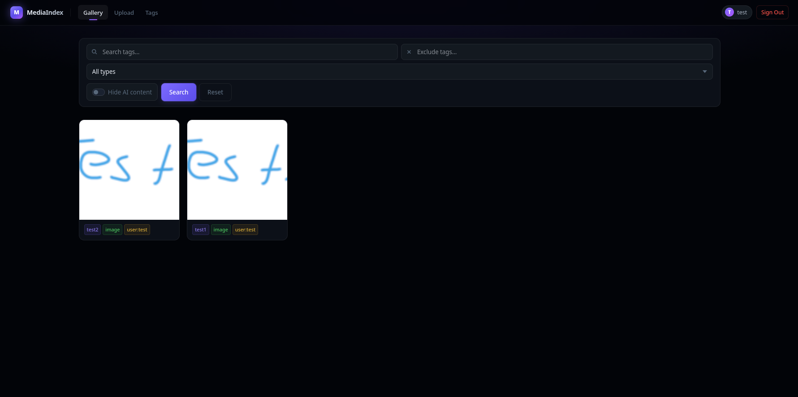

# MediaIndex

A self-hosted media management app for organizing, browsing, and tagging images, GIFs, and videos. Built with Flask using the application factory + Blueprint pattern, it features user authentication, tag-based search, automatic thumbnail generation, and a dark-themed responsive UI.

> [!NOTE]
> AI helps me build this stuff. I check over everything and try to fix bugs as fast as possible. Not a master, just building and learning!

## Features

- **Multi-format support** — images (jpg, jpeg, png, webp, heic), GIFs, and videos (mp4, webm, avi, mov, mkv)
- **Automatic thumbnails** — generated from images, GIF first frames, and video frames
- **Duplicate detection** — SHA-256 hash prevents storing the same file twice
- **Private uploads (encrypted at rest)** — mark any upload private; the file *and* its thumbnail are encrypted with a per-user AES-256 key and hidden from everyone else. Encrypted videos still stream via HTTP range requests. See [Private Uploads & Encryption](#private-uploads--encryption).
- **Tag system** — comma-separated tags, per-file editing, tag statistics page, automatic `user:<name>` tag on every upload
- **User accounts** — registration/login with hashed passwords (8-char minimum), rate-limited login (5/min) and registration (5/hr)
- **Failed-login IP banning** — permanent ban after 10 failed attempts from the same IP
- **Search & filter** — filter by type, search by tag, include/exclude tags, hide AI content, and a "private only" view
- **Infinite scroll gallery + randomized feed** — paginated APIs with JS-driven scroll and a reproducible per-session shuffle seed
- **Security headers** — HSTS, CSP, X-Frame-Options, Referrer-Policy, etc.
- **Reverse-proxy ready** — `ProxyFix` middleware trusts one upstream proxy (e.g. Nginx Proxy Manager)
- **Docker support** — single `docker compose up` deployment

<p align="center">
  
</p>

## Requirements

- Docker & Docker Compose (recommended), **or**
- Python 3.11+, FFmpeg, Redis

## Quick Start (Docker)

### 1. Clone the repository

```bash
git clone https://github.com/Houdini99/media_index.git
cd media_index
```

### 2. Create the environment file

```bash
cp .env.example .env
```

Edit `.env` and set a strong `SECRET_KEY`:

```bash
python -c "import secrets; print(secrets.token_hex(32))"
```

Paste the output as the value of `SECRET_KEY` in `.env`.

### 3. Create data directories and empty database files

Docker bind-mounts require the host paths to exist before the container starts:

```bash
mkdir -p media_files thumbnails log
touch media_index.db users.db
```

### 4. Start the stack

```bash
docker compose up -d
```

The app will be available at `http://localhost:5001` (or whatever `PORT` you set in `.env`).

### 5. Register the first user

Open the app in your browser and navigate to `/register` to create your account. To disable public registration after setup, set `REGISTRATION_OPEN = False` in [app/config.py](app/config.py) and rebuild the image.

---

## Manual Deployment (without Docker)

### Prerequisites

- Python 3.11+
- FFmpeg installed system-wide (`sudo apt install ffmpeg` / `brew install ffmpeg`)
- Redis running on `localhost:6379` (or set `REDIS_URL` in your environment)

### Setup

```bash
git clone https://github.com/Houdini99/media_index.git
cd media_index

python -m venv venv
source venv/bin/activate      # Windows: venv\Scripts\activate

pip install -r requirements.txt
```

### Configure environment

```bash
cp .env.example .env
# Edit .env — set SECRET_KEY and optionally DEV_MODE, REDIS_URL, PORT
export $(grep -v '^#' .env | xargs)
```

### Run

```bash
python run.py
```

For production, use a WSGI server (Gunicorn):

```bash
pip install gunicorn
gunicorn -w 2 -b 0.0.0.0:5001 run:app
```

`run:app` works because `run.py` exposes `app = create_app()` at module scope.

---

## Reverse Proxy (Nginx / Nginx Proxy Manager)

The app trusts one upstream proxy via `ProxyFix`. Point your proxy to `http://<host>:5001` and ensure it forwards the standard `X-Forwarded-*` headers.

Example Nginx location block:

```nginx
location / {
    proxy_pass         http://127.0.0.1:5001;
    proxy_set_header   Host              $host;
    proxy_set_header   X-Real-IP         $remote_addr;
    proxy_set_header   X-Forwarded-For   $proxy_add_x_forwarded_for;
    proxy_set_header   X-Forwarded-Proto $scheme;
    client_max_body_size 10G;
}
```

---

## Configuration Reference

All runtime configuration is done via environment variables (or the `.env` file when using Docker Compose). Defaults live in [app/config.py](app/config.py).

| Variable | Default | Description |
|----------|---------|-------------|
| `SECRET_KEY` | *(required)* | Flask session signing key. Generate with `secrets.token_hex(32)`. |
| `DEV_MODE` | `false` | Set to `true` in local dev to disable HTTPS-only session cookies. |
| `REDIS_URL` | `redis://localhost:6379` | Redis connection URI used by the rate limiter. The bundled `docker-compose.yml` overrides this to `redis://redis:6379` so it reaches the `redis` service. |
| `PORT` | `5001` | Host port exposed by Docker Compose; also the port the app listens on. |

Tunables in [app/config.py](app/config.py) (edit the file to change them):

| Constant | Default | Description |
|----------|---------|-------------|
| `UPLOAD_FOLDER` | `<project_root>/media_files` | Directory for uploaded files. |
| `THUMB_FOLDER` | `<project_root>/thumbnails` | Directory for generated thumbnails. |
| `THUMB_SIZE` | `(150, 150)` | Thumbnail dimensions in pixels. |
| `PAGE_SIZE` | `30` | Items per page in the gallery / feed. |
| `BAN_THRESHOLD` | `10` | Failed logins from one IP before a permanent ban. |
| `REGISTRATION_OPEN` | `True` | Toggle to close public registration. |
| `MAX_CONTENT_LENGTH` | `10 GiB` | Maximum upload size. |

---

## Project Structure

```
media-index/
├── run.py                       # Entry point (Docker CMD target)
├── requirements.txt
├── Dockerfile
├── docker-compose.yml
├── .dockerignore
├── .env.example                 # Environment variable template
├── .gitignore
├── README.md
└── app/
    ├── __init__.py              # create_app() factory
    ├── config.py                # Env-driven configuration
    ├── extensions.py            # csrf, limiter (no-app-bound)
    ├── logging_setup.py         # StreamToLogger + rotating file handler
    ├── auth/
    │   ├── __init__.py          # auth Blueprint
    │   ├── routes.py            # /login /register /logout + login_required
    │   └── db.py                # Auth SQL: users (+ per-user enc_key), failed_logins, IP bans
    ├── media/
    │   ├── __init__.py          # media Blueprint
    │   ├── routes.py            # / /upload /feed /tags /api/* /thumbs /media
    │   ├── db.py                # Media SQL: media table, tag stats, queries
    │   ├── processing.py        # File hashing + image/video thumbnailing
    │   └── crypto.py            # AES-256-CTR encrypt/range-decrypt for private files
    ├── main/
    │   ├── __init__.py          # main Blueprint
    │   └── routes.py            # /favicon.ico, /robots.txt
    ├── templates/
    │   ├── base.html            # Layout (nav + flashes + content blocks)
    │   ├── _nav.html            # Nav partial
    │   ├── _flash.html          # Flash-messages partial
    │   ├── index.html           # Gallery
    │   ├── upload.html          # Upload page
    │   ├── tags.html            # Tag statistics
    │   ├── feed.html            # Randomized feed
    │   └── auth/
    │       ├── auth_base.html
    │       ├── login.html
    │       └── register.html
    └── static/
        ├── css/                 # common.css, auth.css, index.css, ...
        └── js/                  # index.js, upload.js, tags.js, feed.js

# Runtime state (excluded from git):
# media_files/    thumbnails/    log/    media_index.db    users.db
```

### Architectural notes

- **App factory** — `create_app()` builds and configures the Flask instance; nothing runs at import time.
- **Three blueprints** — `auth_bp`, `media_bp`, `main_bp` keep concerns separated.
- **Grouped raw SQL** — every `sqlite3.connect()` lives in `app/auth/db.py` or `app/media/db.py`. Routes never embed SQL.
- **Static frontend** — all CSS and JS live as files under `app/static/`. Templates use Jinja `` inheritance from `base.html`.
- **Absolute paths** — `Config` anchors all filesystem locations at `PROJECT_ROOT` (the directory containing `run.py`), so paths are immune to the process working directory.

---

## Private Uploads & Encryption

Any file can be flagged **private** at upload time (a per-file toggle on the upload page). Private media is encrypted at rest and is only ever visible to the user who uploaded it.

**How it works**

- **Per-user key** — every user has a random 32-byte AES-256 key stored in the `enc_key` column of `users.db`. It is minted at registration, and lazily generated on first private upload for accounts created before the feature existed.
- **What gets encrypted** — both the original file and its generated thumbnail are encrypted and written with a `.enc` suffix; the plaintext copies are deleted. Public uploads are stored as-is.
- **AES-256-CTR + streaming** — CTR mode lets the server decrypt arbitrary byte ranges without reading the whole file, so encrypted videos still seek and stream correctly over HTTP `Range` requests. On-disk layout is `nonce(16 bytes) || ciphertext` ([app/media/crypto.py](app/media/crypto.py)).
- **Access control** — private rows are filtered out of the gallery, the feed, the tag statistics, and the JSON APIs for everyone except the owner. The `/thumbs` and `/media` file-serving routes also re-check ownership before decrypting, so a leaked filename can't be fetched by another logged-in user. A **"Private only"** toggle on the gallery shows just your own private uploads.

> [!WARNING]
> Encryption keys live in `users.db` alongside the accounts, so this protects file contents on the media disk — **not** against someone who has both your database files. There is no authentication tag (CTR provides confidentiality, not integrity). Treat it as "private from other users of the same instance," not as a hardened secrets vault. Keep `SECRET_KEY` and `users.db` safe, and back up `users.db` — losing it means losing the keys to decrypt every private file.

---

## API Endpoints

| Method | Path | Description |
|--------|------|-------------|
| `GET` | `/` | Gallery page |
| `GET/POST` | `/upload` | Upload media files |
| `GET` | `/feed` | Randomized scroll feed |
| `GET` | `/tags` | Tag statistics page |
| `POST` | `/delete/<id>` | Delete a media item (owner only) |
| `POST` | `/edit/<id>` | Update tags on a media item (owner only) |
| `GET` | `/api/media` | JSON list of media (supports `type`, `search`, `exclude_tags`, `hide_ai`, `private_only`, `page`) |
| `GET` | `/api/feed` | JSON randomized feed (supports `types` (comma-separated, takes precedence over `type`), `search`, `include_tags`, `exclude_tags`, `hide_ai`, `seed`, `page`) |
| `GET` | `/api/tags` | JSON list of all tags |
| `GET` | `/mediadata/<id>` | JSON metadata for a single media item (id, urls, tags, type, uploader, date, `is_private`) |
| `GET` | `/thumbs/<fname>` | Serves a thumbnail (auth-gated; decrypts `.enc` thumbnails on the fly) |
| `GET` | `/media/<fname>` | Serves the original media file (auth-gated; decrypts `.enc` files on the fly with HTTP `Range` support) |
| `GET/POST` | `/login` | Login page |
| `GET/POST` | `/register` | Registration page |
| `POST` | `/logout` | Logout |
| `GET` | `/favicon.ico` / `/robots.txt` | Static |

---

## Tech Stack

- **Backend**: Python 3.11, Flask (factory + Blueprints), Flask-WTF (CSRF), Flask-Limiter
- **Storage**: SQLite (media & users), local filesystem (files & thumbnails)
- **Cache / Rate Limiting**: Redis
- **Image processing**: Pillow
- **Video processing**: moviepy + FFmpeg
- **Encryption**: `cryptography` (AES-256-CTR for private files)
- **Frontend**: Vanilla JS, CSS custom properties, dark theme

## License

MIT
